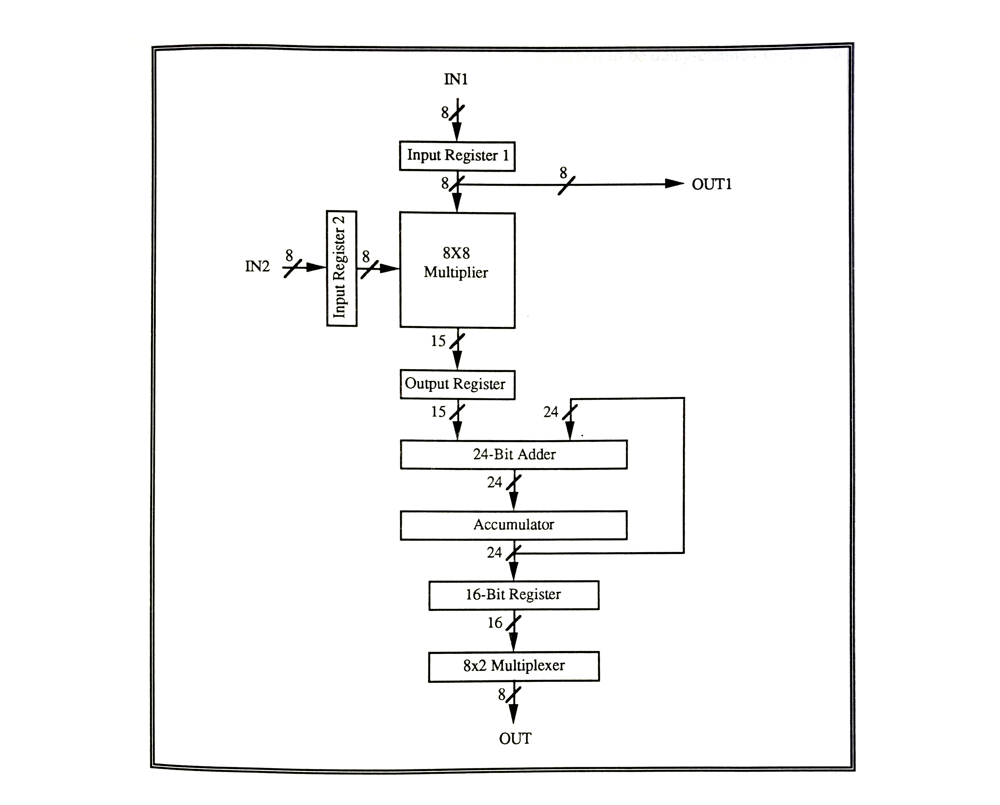
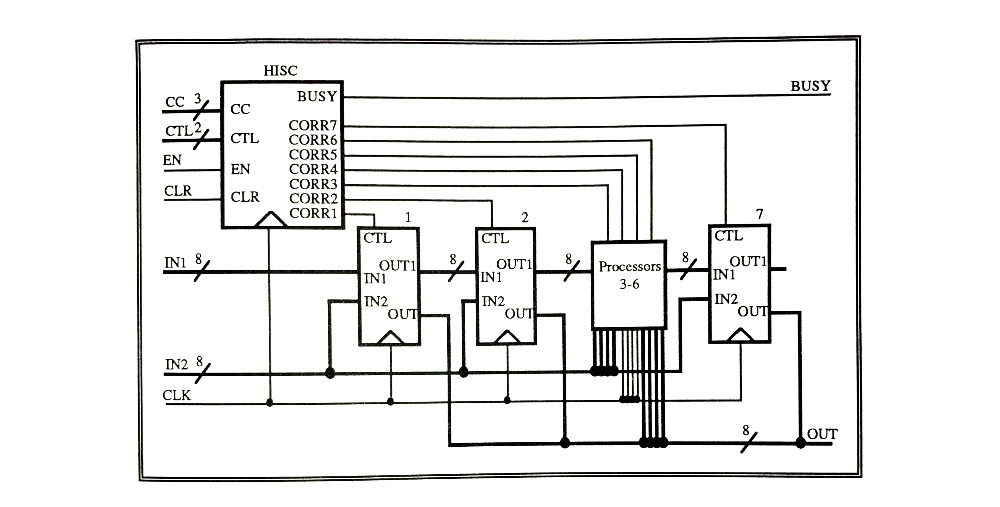

# APPENDIX B

[Table of Contents](https://github.com/JeffDeCola/my-masters-thesis#table-of-contents)

* [HOST INTERFACE SERIAL CONTROLLER (HISC) (CORRELATOR CONTROLLER) ARCHITECTURE](https://github.com/JeffDeCola/my-masters-thesis/blob/master/appendices/appendix-b/appendix-b.md#host-interface-serial-controller-hisc-correlator-controller-architecture)
  * [I. NASA CORRELATOR](https://github.com/JeffDeCola/my-masters-thesis/blob/master/appendices/appendix-b/appendix-b.md#i-nasa-correlator)
  * [II. CORRELATOR PROCESSOR ARCHITECTURE](https://github.com/JeffDeCola/my-masters-thesis/blob/master/appendices/appendix-b/appendix-b.md#ii-correlator-processor-architecture)
  * [III. HOST INTERFACE SERIAL CONTROLLER](https://github.com/JeffDeCola/my-masters-thesis/blob/master/appendices/appendix-b/appendix-b.md#iii-host-interface-serial-controller)

## HOST INTERFACE SERIAL CONTROLLER (HISC) (CORRELATOR CONTROLLER) ARCHITECTURE

### I. NASA CORRELATOR

A Wave/Particle Correlator was designed by UNH students specifically to be used
by NASA for the purpose of examining, high in the ionosphere, the cause and
effect of a band of electromagnetic energy and high-energy electrons.
NASA wants to know if the wave and particle phenomena are related and, if so,
which way the energy is going. By determining the phase difference between
the electromagnetic waves and the periodic occurrence of the electrons
would tell them which one leads and which one lags, hence given
given NASA the ability to determine their relationship.

The phase difference is obtained by taking the cross-correlation between the
quantitative measures of each event. The electromagnetic wave power is
available from a spectrum analyzer and the presence of the electrons is
available from an electron counter.

The only element that needed to be designed was the cross-correlation function,
for which NASA decided to use a customized hardware device
[[Davi91]](https://github.com/JeffDeCola/my-masters-thesis/blob/master/references/references.md#davi91).

### II. CORRELATOR PROCESSOR ARCHITECTURE

The correlator processor needs to calculate the cross-correlation function
between the two data streams -electromagnetic wave power and electron count.
The values in each stream are 8-bits wide and arrive serially, up to 16MHz.
The correlator consists of a systolic array of processors, each working on a
separate term in the correlation function. To make a correlation function, the
processor first multiplies then accumulate the sum. It was determined that a
24-bit memory (accumulator) was needed for each processor. The resolution of
the phase angle is a function of the number of processors and the sampling
rate, so a number of processors must be made available.

The processor architecture can be broken down into three main sections as shown
in Figure B.l. The first is a registered multiplier for multiplying the two
8-bit inputs. A sign extended 15-bit output is placed into an output register
for adding and one of the inputs is placed on the OUTl line. The second section
is a 24-bit adder/accumulator pair with output circuitry. During each clock
cycle, a new product is added to the accumulator. The accumulator is also
registered with a 16-bit register. This register is used to inspect the value
of the processor without having to stop the processing of data. The third
section (not shown) is the control section, which distributes the clock and
the control signals, monitors the accumulator for an underflow or an overflow
and sets up a mask in the output latch should an underflow or overflow occur.
There are four basic control signals: Master reset for or all the registers,
accumulator reset for the accumulator, latch output to get the value from the
accumulator and enable output to output the value to the host.

**Figure B.1** *Correlator Processor Architecture*

The correlator was fabricated at MOSIS using a 2-micron CMOS process and was
placed in a 108-pin ceramic pin grid array (PGA) package. A medium
(6.8mm X 6.9mm) die was used, containing about 15,000 transistors.
The chip holds ten processors, each with its own output. The ten processors
each have a 16-bit output register, each linked into a 10x16-bit shift register.
The output register values are shifted and presented a 16 output pins one
value at a time. The chip is designed to be daisy-chained together to provide
a processor array of variable length.

### III. HOST INTERFACE SERIAL CONTROLLER

The next objective was to partition the design for use with a 40-pin tiny
(2.2mm X 2.25mm) die. The goal is to eventually use these chips in an MCM.
Tiny dies were chosen because they are standard, easy to design with, and
the tools and means are readily available at UNH. The problem was the pin
limitation. A 40-pin pad frame has only 34 1/0 pins available for use. Two
pins are used for power and ground, and four are used to power the pad frame.

It was determined that one processor can be placed in a tiny pad frame.
Sixteen pins are needed for the two 8-bit inputs, eight are needed for
the OUTl line, eight are needed for the 8-bit output, and one is needed for the
clock signal. This leaves only one pin for the control signals, where at
least two are needed because of the four control functions. Therefore, the
control signal must be serially transmitted to the processor, hence the name,
Host Interface Serial Controller (HISC).

The HISC, also known as the Correlator Controller in the laboratories
([Appendices D-K](https://github.com/JeffDeCola/my-masters-thesis/blob/master/appendices/appendix-d/appendix-d.md#appendix-d)),
is designed to manage the interface between the processors and the host
computer, facilitating the control signals to individual processors
(See Figure B.2). The msc can control up to seven processors separately, or
all together. There can be more than one controller used if more
processors are required. To prevent the host from sending more than
one commands to the HISC at a time, a busy signal is generated. This
signal is monitored by the host and eliminates the need for queue
or priority logic.

**Figure B.2** *Correlator Controller with Seven Processors*

The internal structure of the HISC is located in Laboratories 2A-3A
([Appendices D-E](https://github.com/JeffDeCola/my-masters-thesis/blob/master/appendices/appendix-d/appendix-d.md#appendix-d)).
It explains in detail, the logic of the state machines
control sequences, the control signal decoder, the Correlator Chooser
and miscellaneous glue logic. The HISC was prototyped using FPGAs.
