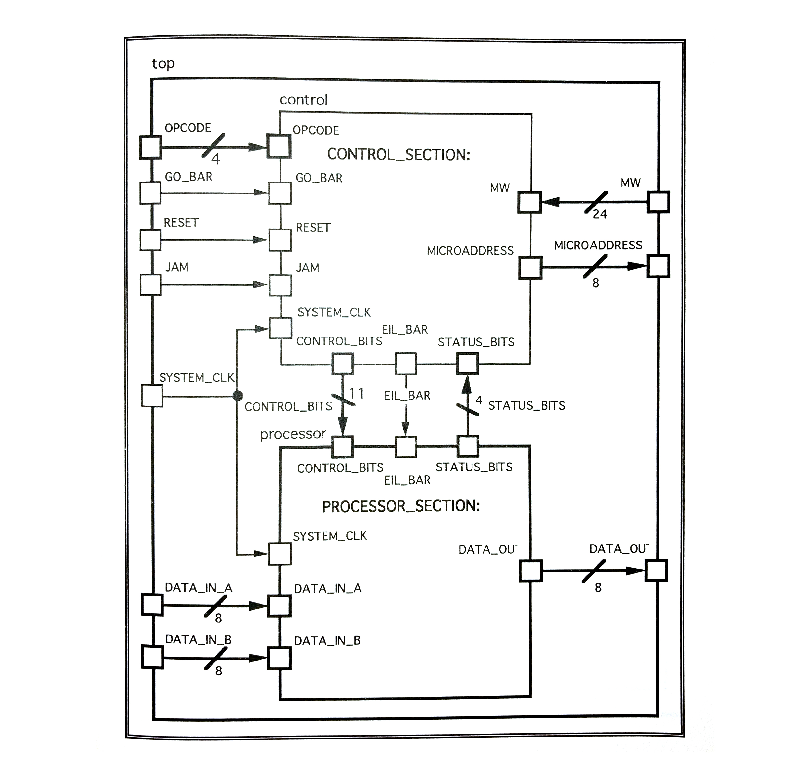
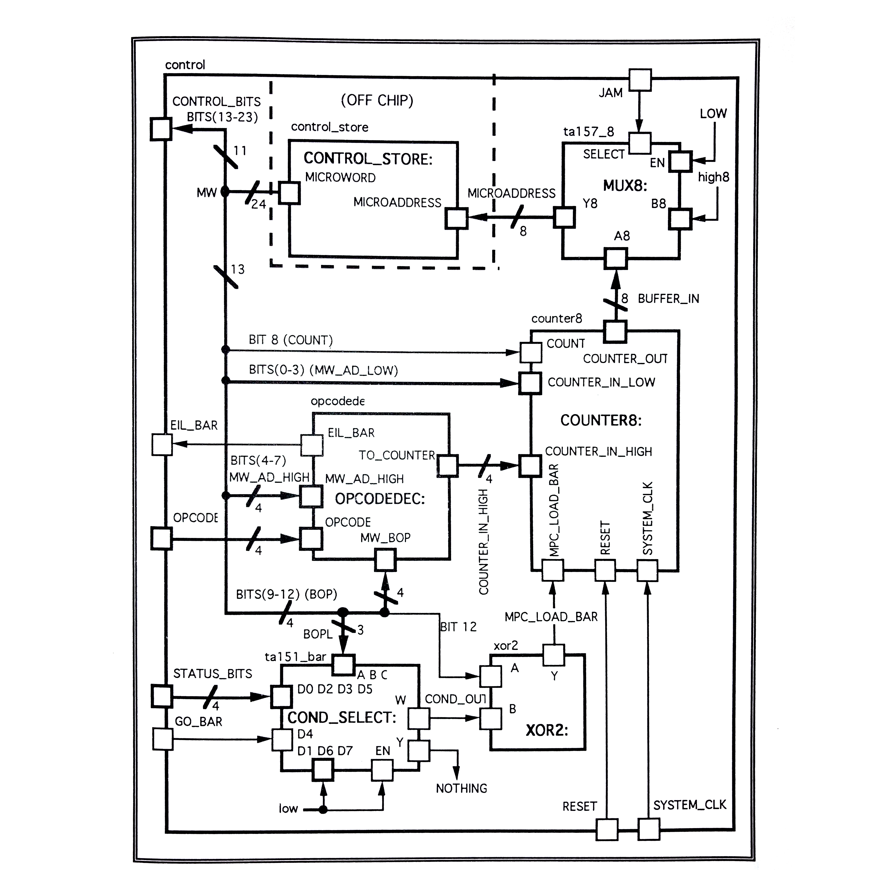
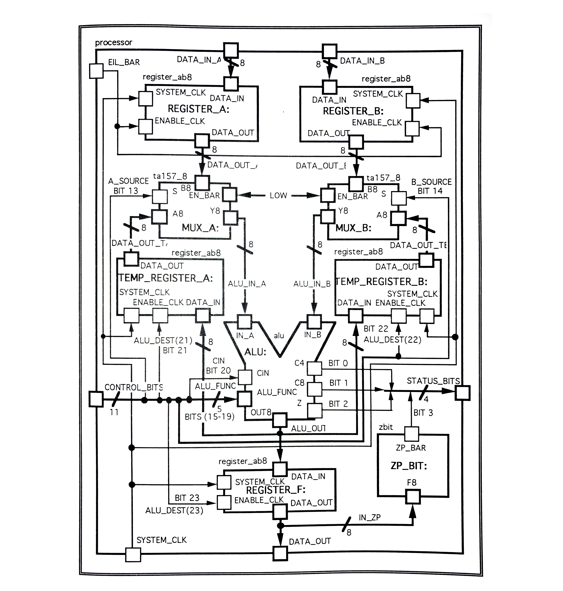

# APPENDIX L

**NOTE:** _I translated the following programable 8-bit microprocessor
in my Thesis, from VHDL to verilog, and have a full working synthesizable
example in
[my-systemverilog-examples](https://github.com/JeffDeCola/my-systemverilog-examples/tree/master/systems/microprocessors/programable-8-bit-microprocessor)
repo._

[Table of Contents](https://github.com/JeffDeCola/my-masters-thesis#table-of-contents)

* [PROGRAMABLE 8-BIT MICROPROCESSOR](https://github.com/JeffDeCola/my-masters-thesis/blob/master/appendices/appendix-l/appendix-l.md#programable-8-bit-microprocessor)
  * [I. TOP-LEVELS OF THE MICROPROCESSOR](https://github.com/JeffDeCola/my-masters-thesis/blob/master/appendices/appendix-l/appendix-l.md#i-top-levels-of-the-microprocessor)
  * [II. GENERIC VHDL TEST GENERATION TEMPLATE](https://github.com/JeffDeCola/my-masters-thesis/blob/master/appendices/appendix-l/appendix-l.md#ii-generic-vhdl-test-generation-template)
  * [III. STRUCTURAL VHDL DESCRIPTION OF THE 8-BIT MICROPROCESSOR](https://github.com/JeffDeCola/my-masters-thesis/blob/master/appendices/appendix-l/appendix-l.md#iii-structural-vhdl-description-of-the-8-bit-microprocessor)

## PROGRAMABLE 8-BIT MICROPROCESSOR

### I. TOP-LEVELS OF THE MICROPROCESSOR

**Figure L.1** *Top-Level Block Diagram of the 8-bit Microprocessor*

**Figure L.2** *Control Block of the 8-bit Microprocessor*

**Figure L.3** *Processor Block of the 8-bit Microprocessor*

### II. GENERIC VHDL TEST GENERATION TEMPLATE

**NOTE:** _I translated the original VHDL in my Thesis into
verilog and have a full working testbench in
[my-systemverilog-examples](https://github.com/JeffDeCola/my-systemverilog-examples/tree/master/systems/microprocessors/programable-8-bit-microprocessor)
repo._

### III. STRUCTURAL VHDL DESCRIPTION OF THE 8-BIT MICROPROCESSOR

**NOTE:** _Keeping the exact same structure, ports, and logic, I translated the
original VHDL in my Thesis into verilog and have a full working synthesizable
example in
[my-systemverilog-examples](https://github.com/JeffDeCola/my-systemverilog-examples/tree/master/systems/microprocessors/programable-8-bit-microprocessor)
repo._
