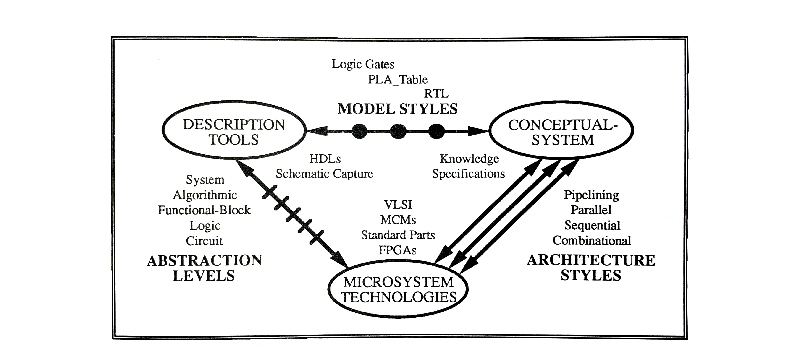

# CHAPTER 2

[Table of Contents](https://github.com/JeffDeCola/my-masters-thesis#table-of-contents)

* 2.1 [Design Domain](https://github.com/JeffDeCola/my-masters-thesis/blob/master/chapters/chapter-2/chapter-2.md#21-design-domain)
  * 2.1.1 [Schematic Capture View of the Design Domain](https://github.com/JeffDeCola/my-masters-thesis/blob/master/chapters/chapter-2/chapter-2.md#211-schematic-capture-view-of-the-design-domain)
  * 2.1.2 [VHDL View of the Design Domain](https://github.com/JeffDeCola/my-masters-thesis/blob/master/chapters/chapter-2/chapter-2.md#212-vhdl-view-of-the-design-domain)
* 2.2 [Design Framework](https://github.com/JeffDeCola/my-masters-thesis/blob/master/chapters/chapter-2/chapter-2.md#22-design-framework)
* 2.3 [Technology Migration (Horizontal Design Methodology)](https://github.com/JeffDeCola/my-masters-thesis/blob/master/chapters/chapter-2/chapter-2.md#23-technology-migration-horizontal-design-methodology)
  * 2.3.1 [Technology Migration using Schematic Capture](https://github.com/JeffDeCola/my-masters-thesis/blob/master/chapters/chapter-2/chapter-2.md#231-technology-migration-using-schematic-capture)
  * 2.3.2 [Technology Migration using VHDL](https://github.com/JeffDeCola/my-masters-thesis/blob/master/chapters/chapter-2/chapter-2.md#232-technology-migration-using-vhdl)
* 2.4 [Summary](https://github.com/JeffDeCola/my-masters-thesis/blob/master/chapters/chapter-2/chapter-2.md#24-summary)

## DESIGN DOMAIN, DESIGN FRAMEWORK AND TECHNOLOGY MIGRATION IN MICROSYSTEM DEVELOPMENT

This chapter is organized into three sections, beginning with an introduction of
the *digital design domain* in Section 2.1. The digital design domain is a
time-independent (static) graphical representation of three basic interrelated
elements used for viewing a digital system: microsystem technologies,
description tools and the conceptual-system. This section also describes the
design domain as viewed by schematic capture and VHDL description tools showing
the benefits and limitations as to how they affect the designer. Section 2.2
explains the development of the design framework as a time-dependent (dynamic)
representation of the design domain. The low and high-level frameworks are also
discussed herein. The design framework contains system models, EDA tools,
microsystem technologies and design methodologies. The framework is used
throughout the thesis to view and analyze all aspects of system development.
Lastly, Section 2.3 introduces technology migration, a key element within
the high-level design framework.

## 2.1 Design Domain

The digital design domain is a collection of three basic interrelated elements:
microsystem technologies, description tools and the conceptual-system as shown
in Figure 2.1. The latter two elements are defined as:

* *Description tools* are software tools used to help a designer create,
at a certain abstraction layer, a model of a system. Schematic capture and
HDL are two popular tools.
* The *conceptual-system* element represents the designer's idea
(i.e. knowledge and specifications) of a system, as opposed to the term
'system' by itself, which implies a physical structure.

The digital design domain represents a designer's view of a digital system
[[Gajs91]](https://github.com/JeffDeCola/my-masters-thesis/blob/master/references/references.md#gajs91).
It is important because it formulates the foundation of the
design framework.

**Figure 2.1** *The Digital Design Domain*

All digital systems start with a concept, an idea of what the system should
do - its function - typically formulated as a set of design specifications.
This is represented by the conceptual-system element in Figure 2.1,
the designer's knowledge base.

The designer transfers this concept into a system model, using a description
tool such as schematic capture or an HDL. A particular model style is also
used during the transformation.

* A *model style* is a particular classification of a system model that is at
  a certain abstraction level (e.g. Boolean equations, flowcharts and logic gates).

In the figure, the model styles are represented by the dots between the
description tools and conceptual-system elements. Each dot represents a different
model style the designer can use, each style having the same functionality.
The closer the dot is to the conceptual-system element, the more conceptual
the model; the closer the dot is to the description tools element, the less
conceptual the model. For example, RTL statements which are closer to the
conceptual-system have more conceptual meaning than logic gates, which are
closer to the description-tools.

Between the conceptual-system and microsystem technologies elements is a
different type of style, an architecture style that is compatible with a
particular technology.

* An architecture style is a particular configuration of the microsystem
  hardware. Some examples are pipelining, sequential, parallel and combinational.

The architecture styles, represented by the mutually exclusive straight lines
in the figure, are chosen manually by the designer or by an automated synthesis
process. As with model styles, various architectures can by used to represent
the same digital system, each producing the same functionality (although other
characteristics such as power consumption and performance can vary).
Consequently, subtle differences arise between model and architecture styles -
technology imposes constraints on the type of architectural style that can be
used whereas there are no technology constraints on the choice of model style
(ideal case only). This point is examined further in
[Chapter 4](https://github.com/JeffDeCola/my-masters-thesis/blob/master/chapters/chapter-4/chapter-4.md#chapter-4).

The microsystem technologies element in the figure can be anything from
standard parts to MCMs. As explained above, technologies have a great deal of
influence on system development because of the constraints technology
imposes on the choice of an architecture style.
[Chapter 5](https://github.com/JeffDeCola/my-masters-thesis/blob/master/chapters/chapter-5/chapter-5.md#chapter-5)
is fully devoted
to various microsystem technologies and their characteristics.

Between the microsystem technologies and description tools elements are
the abstraction levels, shown by the dashes in the figure.

* An *abstraction level* is a classification of the system model determined
from the model style. As of today, system models can be at one of five basic
levels: circuit, logic, functional-block, algorithmic or system.

The abstraction levels, as shown in Figure 2.1, are positioned with respect
to the microsystem technologies. The closer the levels (dashes) are to the
microsystem technologies element, the more dependent they are on technology.
These are referred to as '*low-level*' and contain the circuit and logic levels.
The closer the levels (dashes) are to the description tools element, the less
dependent they are on technology. These levels are referred to as '*high-level*'
and are above the logic level. The details of these abstraction levels are
further examined in
[Chapter 3](https://github.com/JeffDeCola/my-masters-thesis/blob/master/chapters/chapter-3/chapter-3.md#chapter-3).

A digital system, when viewed in the digital design domain, must be taken as
a whole because there is a strong connection between all three elements
(microsystem technologies, description tools and conceptual-system).
These elements form a bond that cannot be taken separately. For example,
consider a designer using a schematic capture description tool to model a
multiplier at the logic abstraction level, targeted to standard parts
technology using a pipelined architecture. The system is easily spread
around the entire design domain. The pipelined architecture is imbedded
in the schematic drawing which is in turn inherent to the model style.
Considering the elements separately does not provide enough insight
into the whole system. It weakens the entire system model representation.
Hence, the design domain gives the designer a global perspective on the system,
it does not convey much practical information.

The design domain becomes important when analyzing description tools. The area
that a description tool covers in the design domain shows the limitations and
benefits as to how the tool affects the designer.

### 2.1.1 Schematic Capture View of the Design Domain

Figure 2.2 shows the schematic capture description tool view of the
design domain, represented by the area enclosed within the dotted line.
This area is the domain in which the schematic capture description tool
can be utilized. There is a substantial focus on the microsystem technology
and only a slight connection with the conceptual­system element.
Hence, the designer uses the schematic capture description tool to create
a low-level model that is less comprehensible than the designer's actual idea.

**Figure 2.2** *Schematic Capture View of the Digital Design Domain*

### 2.1.2 VHDL View of the Design Domain

A VHDL description tool view of the design domain is shown in Figure 2.3.
The area enclosed within the dotted line is larger, containing the higher
abstraction levels and the conceptual-system element. The designer can model
the design more naturally, at a more conceptual level, closer to the designer's
way of thinking rather than worry about the technology and architecture styles.
The comprehension is due to the fact that VHDL has keywords and constructs that
are rich in mnemonic meaning
[[DGLW92]](https://github.com/JeffDeCola/my-masters-thesis/blob/master/references/references.md#dglw92)
[[Hart87a]](https://github.com/JeffDeCola/my-masters-thesis/blob/master/references/references.md#hart87a).

**Figure 2.3** *VHDL View of the Digital Design Domain*

In order for the design domain to illustrate aspects of system development
(i.e. system models, EDA tools and methodologies), time needs to be incorporated
into it. When this is done, the design framework is constructed.

## 2.2 Design Framework

As mentioned earlier, a design framework includes system models, EDA tools,
microsystem technologies and design methodologies (vertical and horizontal).
This framework helps a designer to visualize and analyze the relationship between
these elements, more specifically it can illustrate synthesis, design automation,
technology migration and tool/technology dependence.

The framework takes shape when time is introduced into the digital design domain
and a combination of the description tools, model styles and conceptual-system
elements combine to form a system model. Hence, there are two elements - microsystem
technologies and system models - instead of the previous three elements
(See Figure 2.4). The term system model is now formally re-defined as:

* A *system model* is created by using a description tool with a particular
  model style to describe a designers idea (conceptual-system).

The system models are located at the top of Figure 2.4 while the target
microsystem technologies are located at the bottom, with the abstraction
levels between them. Virtual time moves from right to left, showing the
advancement of system models and microsystem technologies.

* *Virtual time* represents the essence of time, although not strictly defined.

Furthermore, the architecture styles are now embedded in the design automation tools.

**Figure 2.4** *The Design Framework*

In the figure, three system models are shown at several abstraction levels.
The higher the model in the figure, the higher its abstraction level.
The dashed line in the figure separates the low abstraction levels
(below and including the logic level of abstraction) from the high abstraction
levels (above the logic level of abstraction). The distinction between the
low and high-level design frameworks is also represented in the figure
by the dashed line.

Three technologies are also shown in Figure 2.4, at the physical level,
representing the manufactured device. Technology three is more advanced than
technology one. Technologies can also appear above the physical level
in the design framework (not shown).

A methodology is represented by an arrow. Vertical design methodologies
are represented by the vertical arrows in the figure whereas horizontal methodologies
are represented by the slanted arrows (loose definition). The methodologies used
to create the system models are not shown.

Analysis of Figure 2.4 can provide some practical information about system
development. As an illustration, Model 1, shown in the low-level, has a
vertical design methodology (vertical arrow) related to one technology.
Therefore the model is technology-dependent. Model 2 is at a higher level of
abstraction, providing a means to go to more than one technology, but is shown
as being unable to migrate to future technologies. This model is also classified
as a vertical methodology with a slight horizontal methodology (slanted arrow)
capability. Model 3, shown in the high-level, is the most technology-independent
and can be used for all technologies, even the older ones. Clearly, technology
migration is possible.

This analysis illustrates that the higher the model is in the abstraction
level, the less the model is technology-dependent, thus providing the ability
for technology migration. Working within the high-level framework offers
additional capabilities (i.e. technology migration) over the low-level
framework. Moreover, a high-level design framework is classified mainly on
the basis of a system model being in a high-level of abstraction.

The capabilities of both frameworks are illustrated within each of the
four basic elements in Table 2.1. It is important to note the addition of the
horizontal design methodology (technology migration) in the high-level design
framework. It will be helpful to refer to this particular table throughout
the thesis.

**Table 2.1** *Low and High-Level Design Framework Capabilities*

## 2.3 Technology Migration (Horizontal Design Methodology)

Technology migration is the movement from one technology to another,
usually to a more advanced one. As new microsystem technologies develop at a
fast rate, the technologies of today will undoubtedly be obsolete for use in
the systems of tomorrow. This advancement can take as little as a few years.
Whenever possible, systems should be modeled without a particular technology
in mind (technology-independent). This will, in a sense, make the model
'immortal', allowing it to progress into tomorrow for use with future
technologies. A system could actually be modeled today that cannot be
implemented in a current technology. It could wait years on a shelf to make
a debut with a compatible technology. High-level modeling may allow this
scenario to occur. To support this concept, the schematic capture and
the VHDL description tools are contrasted within the time-dependent
design framework in the following subsections.

### 2.3.1 Technology Migration using Schematic Capture

Low-level schematic capture models of the same digital system are shown within
the design framework in Figure 2.5. Each model is targeted to a different
technology (i.e. technology-dependent). These low-level abstraction models are
very limiting to technology migration. When updating the system to a new
technology, a designer must remodel the entire system (worst case scenario).
The figure shows that the system has to be modeled four times for the four
separate technologies.
[Chapter 4](https://github.com/JeffDeCola/my-masters-thesis/blob/master/chapters/chapter-4/chapter-4.md#chapter-4)
will explain how to salvage these low-level
system models for use with other technologies.

**Figure 2.5** *The Design Framework with Schematic Capture Models*

### 2.3.2 Technology Migration using VHDL

A VHDL model, as shown in Figure 2.6, is illustrated to be technology ­independent
because it is higher in the abstraction levels than the schematic capture models.
The system can be modeled once, then synthesized down to many technologies.
No redesign is needed; one model is used for all the technologies (ideal case),
instead of four needed with schematic capture. The role of synthesis is fully
explained in
[Chapter 4](https://github.com/JeffDeCola/my-masters-thesis/blob/master/chapters/chapter-4/chapter-4.md#chapter-4).

**Figure 2.6** *The Design Framework with a VHDL Model Illustrating Technology Migration*

## 2.4 Summary

From this discussion, the design framework is a two dimensional methodological
structure that captures various design methodologies targeted to their
corresponding technologies. The framework, in essence, can illustrate a design
methodology (horizontal) within a design ·methodology (vertical)
(i.e. technology migration).
