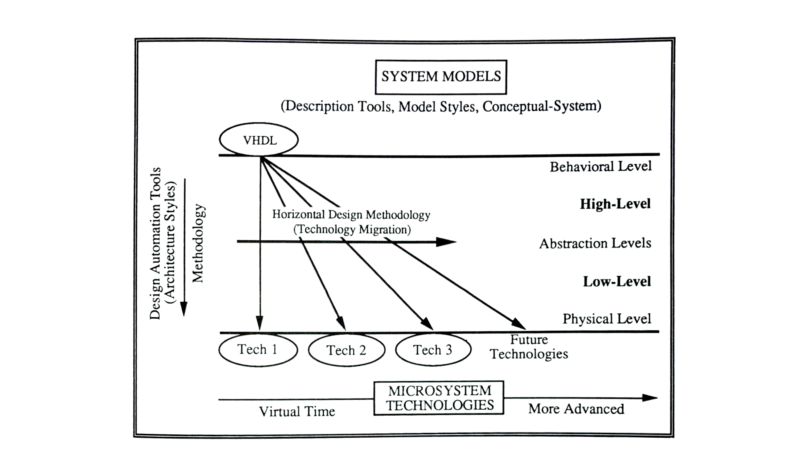

# CHAPTER 7

[Table of Contents](https://github.com/JeffDeCola/my-masters-thesis#table-of-contents)

* 7.1 [High-Level Design Methodology (Technology Migration)](https://github.com/JeffDeCola/my-masters-thesis/blob/master/chapters/chapter-7/chapter-7.md#71-high-level-design-methodology-technology-migration)
  * 7.1.1 [Top-Down Modeling](https://github.com/JeffDeCola/my-masters-thesis/blob/master/chapters/chapter-7/chapter-7.md#711-top-down-modeling)
  * 7.1.2 [General High-Level EDA Environment](https://github.com/JeffDeCola/my-masters-thesis/blob/master/chapters/chapter-7/chapter-7.md#712-general-high-level-eda-environment)
  * 7.1.3 [General High-Level EDA Environment](https://github.com/JeffDeCola/my-masters-thesis/blob/master/chapters/chapter-7/chapter-7.md#713-general-high-level-eda-environment)
* 7.2 [Evaluation of Technology Migration](https://github.com/JeffDeCola/my-masters-thesis/blob/master/chapters/chapter-7/chapter-7.md#72-evaluation-of-technology-migration)

## HIGH-LEVEL HORIZONTAL DESIGN METHODOLOGY (TECHNOLOGY MIGRATION)

This chapter has two sections.
[Section 7.1](https://github.com/JeffDeCola/my-masters-thesis/blob/master/chapters/chapter-7/chapter-7.md#71-high-level-design-methodology-technology-migration)
explains a high-level horizontal design methodology (technology migration),
built upon the vertical design methodology from
[Chapter 6](https://github.com/JeffDeCola/my-masters-thesis/blob/master/chapters/chapter-6/chapter-6.md#chapter-6)
and contained within the high-level design framework. To help illustrate
technology migration, the use of the VHDL description tool in implementing
a RISC will be referred to (Refer to Laboratories 2B-5B
([Appendices H-K](https://github.com/JeffDeCola/my-masters-thesis/blob/master/appendices/appendix-h/appendix-h.md))
for the complete design process). This section also contrasts the low and
high-level design methodologies. It is determined that technology migration
is better suited for complex system development. Lastly,
[Section 7.2](https://github.com/JeffDeCola/my-masters-thesis/blob/master/chapters/chapter-7/chapter-7.md#72-evaluation-of-technology-migration)
evaluates technology migration.

## 7.1 High-Level Design Methodology (Technology Migration)

The advantages of high-level system models, as discussed throughout the
entire thesis, are the key to technology migration. Figure 7.1 illustrates
technology migration in the high-level design framework, showing the horizontal
flow and the multiplicity of the model/technology pairs.

**Figure 7.1** *High-Level Design Framework*

In the figure, the slanted line is a combination of both the vertical and
horizontal design methodologies, thus a hybrid methodology.
This hybrid methodology, in keeping with convention, could be called a
slanted methodology. But for the sake of brevity, it is, and has been referred
to as a horizontal methodology or technology migration.

In order to better understand the high-level horizontal design methodology; top­
down modeling, the general high-level VHDL EDA environment, and the general steps
of the methodology are addressed.

### 7.1.1 Top-Down Modeling

A top-down modeling process, part of the high-level design methodology, is used
mainly because of the advantages of the high-level system models.
Top-down modeling is also known as 'describe and synthesize'; the entire system
is modeled (described) at the top system level using a high-level of abstraction
and synthesized down to lower system and abstraction levels, closer to a
technology. The main advantage of top-down modeling is that the system can be
developed concurrently (design team) and simulated early in the
design process. Also, as the design progresses down into the lower
system levels it can be simulated without the necessity of generating
new test vectors
[[LaMc86]](https://github.com/JeffDeCola/my-masters-thesis/blob/master/references/references.md#lamc86).

### 7.1.2 General High-Level EDA Environment

The schematic capture EDA environment that was shown in Figure 6.2 is
expanded upon to contain the high-level VHDL tools (upper left) as shown in
Figure 7.2. This figure is used as a guide when going through the high-level
horizontal  design methodology steps (next subsection). A brief overview of the
VHDL tools follows.

**Figure 7.2** *General VHDL Tools and File Structure in the EDA Environment*

An ASCII editor or a code designer can be used to create a VHDL .vhd file. The
code designer helps the designer remember VHDL constructs and can also provide
other automated steps. Also, as in the schematic capture environment, an
analyzer (also referred to as compiler) is used to locate errors in the VHDL
model. Furthermore, a high­level DRC can be used on the VHDL model if a known
technology is used (remember, a DRC shows errors that pertain to a particular
technology). A new tool, the debugger, is very similar to debuggers found in
software, allowing the designer to step through code, checking for errors.
Finally, a high-level synthesis process is used to get the model into a
common wirelist form that other EDA tools can use.

For a high-level design methodology to work efficiently, a completely standardized

For a high-level design methodology to work efficiently. a completely
standardized EDA environment is essential. This is because standards provide
venders with the ability to develop compatible tools and designers with the
ability to model portable systems. As stated in
[Chapter 4](https://github.com/JeffDeCola/my-masters-thesis/blob/master/chapters/chapter-4/chapter-4.md#chapter-4),
the CFI is making efforts to establish EDA standards. Some other characteristics
a high-level EDA environment should have are as follows:

* A common user interface (CUI) and a graphical user interface (GUI).
* Environment customization capabilities.
* Concurrent design capabilities.
* Full automation with designer interactivity.
* A design manager for data and process management.

### 7.1.3 General High-Level EDA Environment

Figure 7 .1 illustrates the general steps of a high-level design methodology and
Table 7 .1 lists the steps textually. It can be seen that most of these steps
are also part of the low-level design methodology and are self explanatory
(Refer to
[Chapter 6](https://github.com/JeffDeCola/my-masters-thesis/blob/master/chapters/chapter-6/chapter-6.md#chapter-6)).
There is one added step: synthesis (Refer to
[Chapter 4](https://github.com/JeffDeCola/my-masters-thesis/blob/master/chapters/chapter-4/chapter-4.md#chapter-4)).
The figure also shows that model enhancement and device selection can happen
before or after synthesis, as explained in both
[Chapter 4](https://github.com/JeffDeCola/my-masters-thesis/blob/master/chapters/chapter-4/chapter-4.md#chapter-4)
and
[5](https://github.com/JeffDeCola/my-masters-thesis/blob/master/chapters/chapter-5/chapter-5.md#chapter-5)
respectively. The entire high-level design methodology that was used to develop
a HISC is explained in Laboratories 2B-5B
([Appendices H-K](https://github.com/JeffDeCola/my-masters-thesis/blob/master/appendices/appendix-h/appendix-h.md)).

**Figure 7.3** *General High-Level Design Methodology*

**Table 7.1** *General High-Level Design Methodology Steps*

Although the low-level and high-level design methodology steps are
similar, as expected, some advantages of using VHDL for the high-level design
methodology emerge. These were discovered when performing the laboratory
experiments:

* Design entry is faster because of VHDL's powerful mnemonics.
* Top-down modeling is easier to conceptualize and implement.
* Top-down modeling paves the way for concurrent engineering.
* Technology migration is possible.
* System prototyping is more practical (e.g. prototype a system using
  FPGAs before commitment to an MCM).
* Isolated and integrated simulation becomes possible in the
  multi-level environment.
* Early test vector development for use with entire methodology is more
  efficient.
* Early simulation of the complete system is possible.
* System experimentation (architecture styles) is more feasible.
* Standardized description tools allows technology and tool-independence for
  portability across platforms, tools and microsystem technologies.
* The methodology is faster, allowing accelerated time-to-market.
* It is possible to incorporate high-level system models from other
  sources (e.g. use Intel's Pentium microprocessor during simulation).
  This helps solve proprietary problems. That is, a high-level system
  model will not disclose the chips architecture.
* VHDL template models are useful for design team.

## 7.2 Evaluation of Technology Migration

An evaluation of this methodology will be done in terms of the four goals from
Table 6.2.

The first goal, flexibility, in terms of refining and changing system models,
is quicker and easier with VHDL, than with schematic capture. For example,
changing a state machine sequence (using certain Vl-IDL models) would simply
require typing the new sequence in the appropriate place (Refer to Laboratory 3B
([Appendices I](https://github.com/JeffDeCola/my-masters-thesis/blob/master/appendices/appendix-i/appendix-i.md))).
Compare this to a schematic model, in which the designer would have to go back
to the Karnaugh map stage. Also, because of the high-level models, the
methodology provides the flexibility to experiment with various architectures
and to move to other technologies.

As for the second goal, an effective verification system is provided at all
stages of system development. The entire system can be quickly modeled at the
high abstraction levels, providing a simulation model, early on, which can be
used throughout the entire methodology· Moreover, the test vectors for the
top system level can be used throughout the entire design process.

Third, computer resources are better utilized using VHDL than with schematic
capture, especially when considering high-level simulation. A high-level
VHDL model simulates faster than a collection of AND-OR gates because the
simulator has less 'objects' to consider. Further, the data space is reduced
with the use of ASCII VHDL models, rather than lengthy schematic models.
Also, as with the low-level design methodology, the computer system can
affect the software's speed and much time may have to be spent learning the
various design environments.

Finally, the use of an independent/concurrent teamwork approach works best
with a top-down modeling approach. Everyone can share from the same database
(functionally correct high-level VHDL models and test vectors) and each team
member can simulate the entire system at any time.
